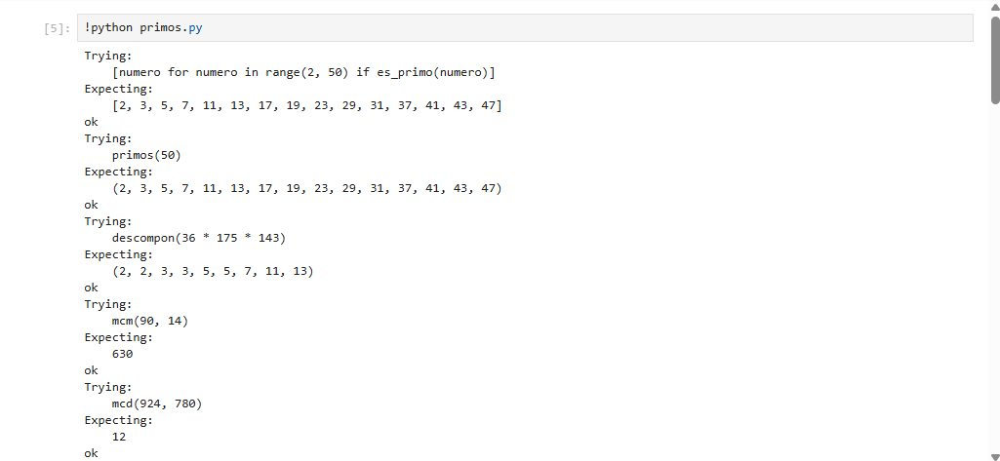
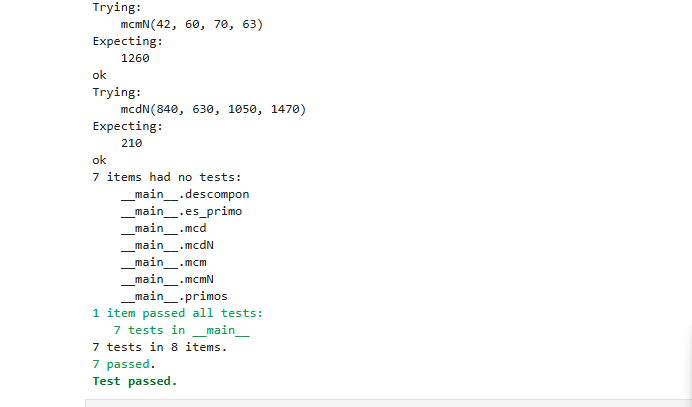

# Segunda tarea de APA 2023: Manejo de números primos


_**[Juan Esteban Palacio]**_

## Fichero `primos.py`

- El alumno debe escribir el fichero `primos.py` que incorporará distintas funciones relacionadas con el manejo
  de los números primos.

- El fichero debe incluir una cadena de documentación que incluirá el nombre del alumno y los tests unitarios
  de las funciones incluidas.

- Cada función deberá incluir su propia cadena de documentación que indicará el cometido de la función, los
  argumentos de la misma y la salida proporcionada.

- Se valorará lo pythónico de la solución; en concreto, su claridad y sencillez, y el uso de los estándares marcados
  por PEP-8. También se valorará su eficiencia computacional.

### Determinación de la *primalidad* y descomposición de un número en factores primos

Incluya en el fichero `primos.py` las tres funciones siguientes:

- `esPrimo(numero)`   Devuelve `True` si su argumento es primo, y `False` si no lo es.
- `primos(numero)`    Devuelve una **tupla** con todos los números primos menores que su argumento.
- `descompon(numero)` Devuelve una **tupla** con la descomposición en factores primos de su argumento.

### Obtención del mínimo común múltiplo y el máximo común divisor

Usando las tres funciones del apartado anterior (y cualquier otra que considere conveniente añadir), escriba otras
dos que calculen el máximo común divisor y el mínimo común múltiplo de sus argumentos:

- `mcm(numero1, numero2)`:  Devuelve el mínimo común múltiplo de sus argumentos.
- `mcd(numero1, numero2)`:  Devuelve el máximo común divisor de sus argumentos.

Estas dos funciones deben cumplir las condiciones siguientes:

- Aunque se trate de una solución sub-óptima, en ambos casos deberá partirse de la descomposición en factores
  primos de los argumentos usando las funciones del apartado anterior.

- Aunque también sea sub-óptimo desde el punto de vista de la programación, ninguna de las dos funciones puede
depender de la otra; cada una debe programarse por separado.

### Obtención del mínimo común múltiplo y el máximo común divisor para un número arbitrario de argumentos

Escriba las funciones `mcmN()` y `mcdN()`, que calculan el mínimo común múltiplo y el máximo común divisor para un
número arbitrario de argumentos:

- `mcm(*numeros)`:  Devuelve el mínimo común múltiplo de sus argumentos.
- `mcd(*numeros)`:  Devuelve el máximo común divisor de sus argumentos.

### Tests unitarios

La cadena de documentación del fichero debe incluir los tests unitarios de las cinco funciones. En concreto, deberán
comprobarse las siguientes condiciones:

- `esPrimo(numero)`:  Al ejecutar `[ numero for numero in range(2, 50) if esPrimo(numero) ]`, la salida debe ser
                      `[2, 3, 5, 7, 11, 13, 17, 19, 23, 29, 31, 37, 41, 43, 47]`.
- `primos(numero)`: Al ejecutar `primos(50)`, la salida debe ser `(2, 3, 5, 7, 11, 13, 17, 19, 23, 29, 31, 37, 41, 43, 47)`.
- `descompon(numero)`: Al ejecutar `descompon(36 * 175 * 143)`, la salida debe ser `(2, 2, 3, 3, 5, 5, 7, 11, 13)`.
- `mcm(num1, num2)`: Al ejecutar `mcm(90, 14)`, la salida debe ser `630`.
- `mcd(num1, num2)`: Al ejecutar `mcd(924, 780)`, la salida debe ser `12`.
- `mcmN(numeros)`: Al ejecutar `mcmN(42, 60, 70, 63)`, la salida debe ser `1260`.
- `mcdN(numeros)`: Al ejecutar `mcdN(840, 630, 1050, 1470)`, la salida debe ser `210`.

### Entrega

#### Ejecución de los tests unitarios

A continuación se muestra la imagen con el resultado de ejecutar el fichero `primos.py` con la opción *verbosa*, de manera que se muestre el resultado de la ejecución de los tests unitarios:





#### Código desarrollado

Aquí se muestra el contenido del fichero `primos.py` con el realce sintáctico en Python:

```python
["""

Autor: Juan Esteban Palacio 


Este módulo proporciona funciones para trabajar con números primos, incluyendo:
- Determinación de primalidad.
- Generación de primos menores que un número dado.
- Descomposición en factores primos.
- Cálculo del mínimo común múltiplo (mcm) y el máximo común divisor (mcd).

Tests unitarios:
>>> [numero for numero in range(2, 50) if es_primo(numero)]
[2, 3, 5, 7, 11, 13, 17, 19, 23, 29, 31, 37, 41, 43, 47]
>>> primos(50)
(2, 3, 5, 7, 11, 13, 17, 19, 23, 29, 31, 37, 41, 43, 47)
>>> descompon(36 * 175 * 143)
(2, 2, 3, 3, 5, 5, 7, 11, 13)
>>> mcm(90, 14)
630
>>> mcd(924, 780)
12
>>> mcmN(42, 60, 70, 63)
1260
>>> mcdN(840, 630, 1050, 1470)
210
"""
from functools import reduce

def es_primo(numero):
    """Devuelve True si el número es primo, False en caso contrario."""
    if numero < 2:
        return False
    for i in range(2, int(numero ** 0.5) + 1):
        if numero % i == 0:
            return False
    return True

def primos(numero):
    """Devuelve una tupla con todos los números primos menores que el argumento."""
    return tuple(n for n in range(2, numero) if es_primo(n))

def descompon(numero):
    """Devuelve una tupla con la descomposición en factores primos del argumento."""
    factores = []
    divisor = 2
    while numero > 1:
        while numero % divisor == 0:
            factores.append(divisor)
            numero //= divisor
        divisor += 1
    return tuple(factores)

def mcm(numero1, numero2):
    """Devuelve el mínimo común múltiplo de dos números."""
    factores1 = descompon(numero1)
    factores2 = descompon(numero2)
    factores_comunes = set(factores1) | set(factores2)
    resultado = 1
    for factor in factores_comunes:
        resultado *= factor ** max(factores1.count(factor), factores2.count(factor))
    return resultado

def mcd(numero1, numero2):
    """Devuelve el máximo común divisor de dos números."""
    factores1 = descompon(numero1)
    factores2 = descompon(numero2)
    factores_comunes = set(factores1) & set(factores2)
    resultado = 1
    for factor in factores_comunes:
        resultado *= factor ** min(factores1.count(factor), factores2.count(factor))
    return resultado

def mcmN(*numeros):
    """Devuelve el mínimo común múltiplo de varios números."""
    return reduce(mcm, numeros)

def mcdN(*numeros):
    """Devuelve el máximo común divisor de varios números."""
    return reduce(mcd, numeros)

if __name__ == "__main__":
    import doctest
    doctest.testmod(verbose=True)
]
```

#### Subida del resultado al repositorio GitHub ¿y *pull-request*?

El fichero `primos.py`, la imagen con la ejecución de los tests unitarios y este mismo fichero, `README.md`, deberán
subirse al repositorio GitHub mediante la orden `git push`. Si los profesores de la asignatura consiguen montar el
sistema a tiempo, la entrega se formalizará realizando un *pull-request* al propietario del repositorio original.

El fichero `README.md` deberá respetar las reglas de los ficheros Markdown y visualizarse correctamente en el repositorio,
incluyendo la imagen con la ejecución de los tests unitarios y el realce sintáctico del código fuente insertado.

